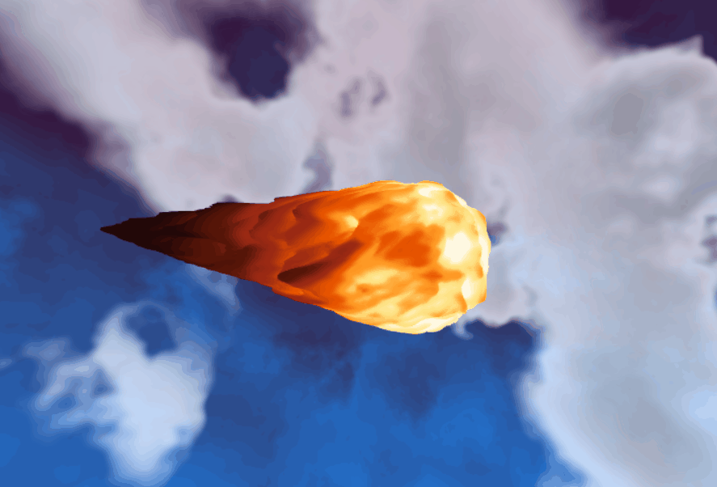

# HW 1: WebGL Fireball

  

(Mark Melkumyan, CIS 5660 Fall 2026)

# Project Description
In this project I created shaders to turn a simple icosphere into a fireball! 🔥

Here's my general approach to making the fireball. For the exact code with comments, see `src\shaders\fireball-vert.glsl` and `src\shaders\fireball-frag.glsl`.

## Fireball Shader
### Vertex pseudocode:

> - Set trail width/length
>   - Alternate between min/max based on pulse frequency
> - Get x position blend factor in range [0,1]
>   - Icosphere x ranges [-1,1]. Modify to [0,1]. 0 = tail of fireball, 1 = tip
>   - Bias range heavily towards 1. We mostly want to move the front verts just a little, and the back ones a LOT
> - Add twist to the vertex's yz domain using `rotatePoint2d`
> - Sample FBM noise warped by another FBM
>   - noise = FBM(twisted.xyz + time + FBM(twisted.xyz))
> - Offset vertex positions by normal * noise
>   - Bias more towards normals in the X, less toward YZ, so the tail is longer

Overall, the idea is to make some lava-ish looking noise with `FBM(FBM())`, twist it, then stretch in the x dimension.

### Fragment pseudocode:

> - Pass noise from vertex shader
> - Calculate distance from frag to tip of fireball
>   - Normalize to [0,1]
> - Sample gradient map of firey colors
>   - rgb = color(t), where t = dist + noise

Passing the noise from the vertex shader lets us shade the bumpier bits with darker colors.

## Background Shader

I also created a shader for the background! It's designed to look like a blue sky with white scrolling clouds.

No real vertex shader, just pass a screenspace quad in NDC.

### Fragment pseudocode:

> - Get ray passing through pixel to origin (referenced from CIS5600 material)
>   - When normalized, this ray maps every pixel to a positon on a unit sphere.
>     - This lets us make a skydome without an actual dome! Just a single quad!
> - Create cloud cover mask. This will determine which pixels use cloud color and which pixels use sky color.
>   - noise = perlinNoise3D(ray + time + FBM3D(ray + time))
>   - Lower noise's gain to add more contrast 
>   - Use a threshold (smoothstep) to solidfy the line between cloud/sky
> - Create sky color
>   - skyNoise = perlinNoise3D(ray + time + FBM3D(ray + time)) again!
>     - Scale this noise so it looks smaller and moves slower- helps fake parallax
>   - Get y position blend factor in range [0,1]. 0 = bottom of dome, 1 = top of dome
>   - Perturb this y value by skyNoise
>     - This will help stir up the gradient (not just a simple linear color change)
>   - Sample gradient map of blue colors using yBlend
> - Create cloud color- just white!
> - Final color = mix(cloud color, sky color, cloud mask)
>   - When mask = 0, use cloud color. When mask = 1, use sky color.

-----------
# Assignment Description

## Objective
Get comfortable with using WebGL and its shaders to generate an interesting 3D, continuous surface using a multi-octave noise algorithm.

## Getting Started
- __Fork__ this repository
- Run `npm install` and `npm run dev` to set up the dependencies for this project
- Under the Github repo settings, navigate to "Build and deployment" -> "Source", and select **GitHub Actions**
- Push (or re-push) to `master`. The workflow will build your project and deploy it automatically. The project should be visible at http://username.github.io/repo-name.

## Assignment Details
- You will alter the vertex and fragment shaders used to render the Icosphere so that it looks like a fireball.
- Your vertex shader should apply a low-frequency, high-amplitude displacement of your sphere so as to make it less uniformly sphere-like. You might consider using a combination of sinusoidal functions for this purpose. We recommend a function of the form `f(x, y, z) = h` to displace your vertices along a vector, such as their surface normals.
- Your vertex shader should also apply a higher-frequency, lower-amplitude layer of fractal Brownian motion to apply a finer level of distortion on top of the high-amplitude displacement.
- Your fragment shader should apply a gradient of colors to your fireball's surface, where the fragment color is correlated in some way to the vertex shader's displacement.
- Both the vertex and fragment shaders should alter their output based on a uniform time variable (i.e. they should be animated). You might consider making a constant animation that causes the fireball's surface to roil, or you could make an animation loop in which the fireball repeatedly explodes.
- Across both shaders, you should make use of at least four of the functions discussed in the Toolbox Functions slides.

## Noise Application
View your noise in action by applying it as a displacement on the surface of your icosahedron, giving your icosahedron a bumpy, cloud-like appearance. Simply take the noise value as a height, and offset the vertices along the icosahedron's surface normals. You are, of course, free to alter the way your noise perturbs your icosahedron's surface as you see fit; we are simply recommending an easy way to visualize your noise. You could even apply a couple of different noise functions to perturb your surface to make it even less spherical.

In order to animate the vertex displacement, use time as the third dimension or as some offset to the (x, y, z) input to the noise function. Pass the current time since start of program as a uniform to the shaders.

For both visual impact and debugging help, also apply color to your geometry using the noise value at each point. There are several ways to do this. For example, you might use the noise value to create UV coordinates to read from a texture (say, a simple gradient image), or just compute the color by hand by lerping between values.

## Interactivity
Using dat.GUI, make at least THREE aspects of your demo interactive variables. For example, you could add a slider to adjust the strength or scale of the noise, change the number of noise octaves, etc.

Add a button that will restore your fireball to some nice-looking (courtesy of your art direction) defaults.

## Extra Spice
Choose one of the following options:

- Background (easy-hard depending on how fancy you get): Add an interesting background or a more complex scene to place your fireball in so it's not floating in a black void
- Custom mesh (easy): Figure out how to import a custom mesh rather than using an icosahedron for a fancy-shaped cloud.
- Mouse interactivity (medium): Find out how to get the current mouse position in your scene and use it to deform your cloud, such that users can deform the cloud with their cursor.
- Music (hard): Figure out a way to use music to drive your noise animation in some way, such that your noise cloud appears to dance.

## Submission
1. Create a pull request to this repository with your completed code.
2. Update README.md to contain a solid description of your project with a screenshot of some visuals, and a link to your live demo.
3. Submit the link to your pull request on Gradescope, and add a comment to your submission with a hyperlink to your live demo.
4. Include a link to your live site.

## Resources
- Javascript modules https://developer.mozilla.org/en-US/docs/Web/JavaScript/Reference/Statements/import
- Typescript https://www.typescriptlang.org/docs/home.html
- dat.gui https://workshop.chromeexperiments.com/examples/gui/
- glMatrix http://glmatrix.net/docs/
- WebGL
  - Interfaces https://developer.mozilla.org/en-US/docs/Web/API/WebGL_API
  - Types https://developer.mozilla.org/en-US/docs/Web/API/WebGL_API/Types
  - Constants https://developer.mozilla.org/en-US/docs/Web/API/WebGL_API/Constants
